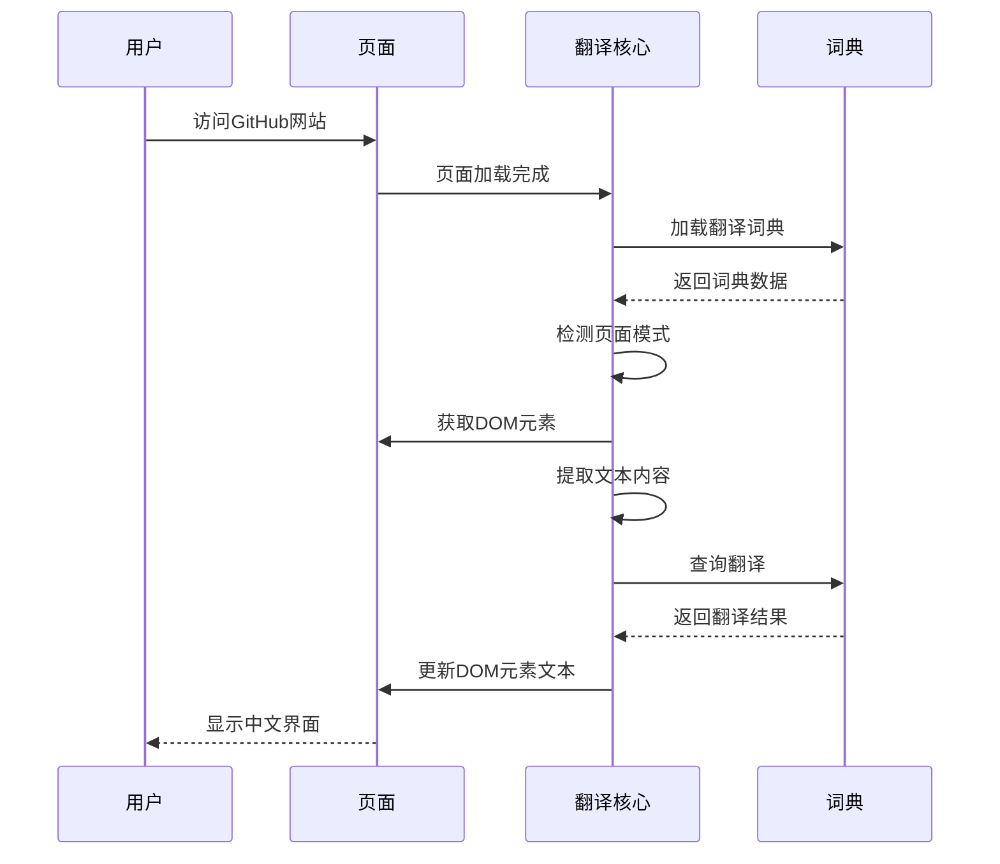
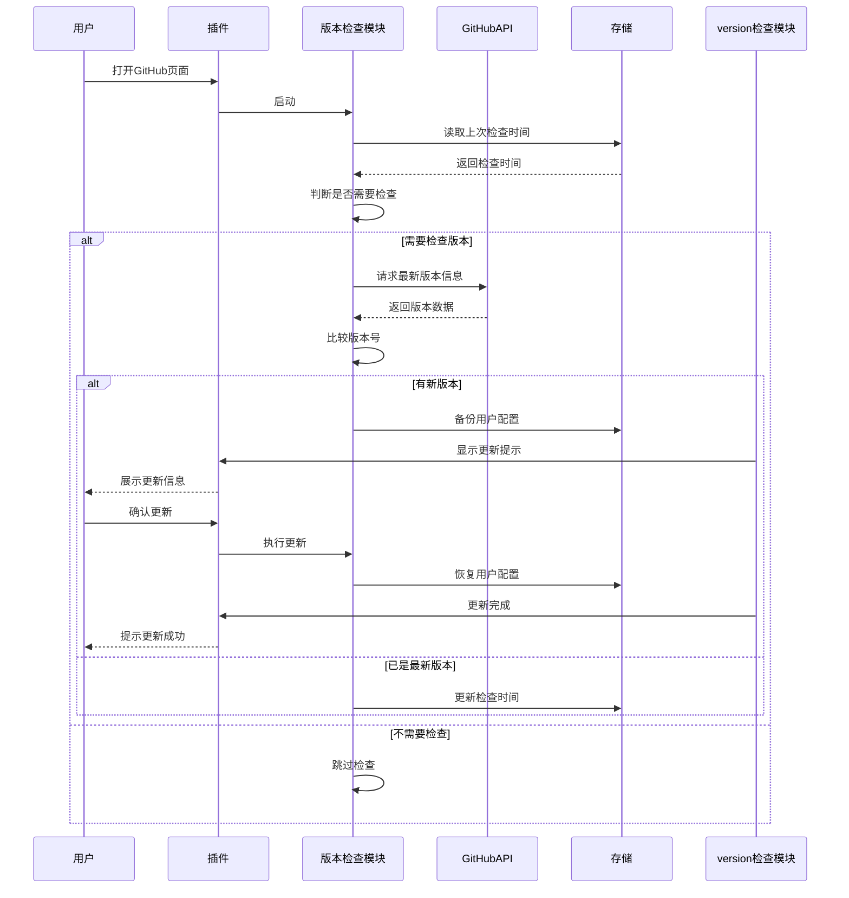
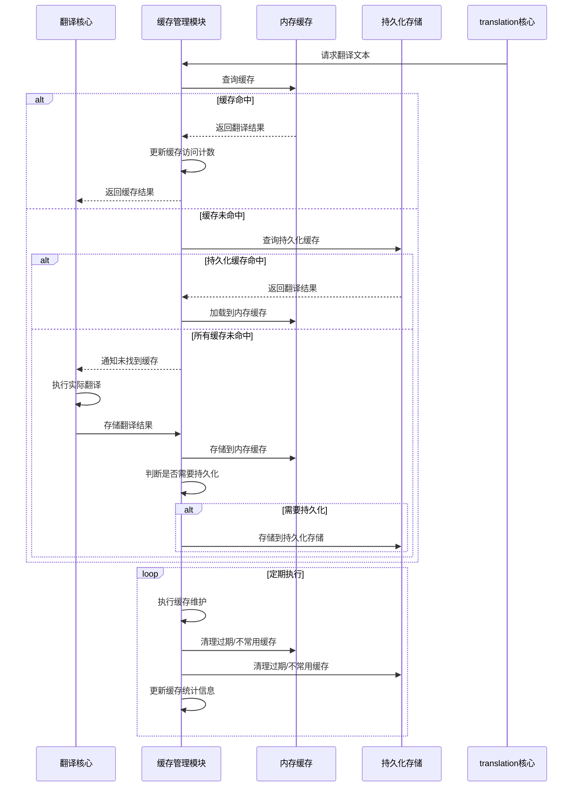

# GitHub i18n 功能模块说明

## 目录说明

此目录包含项目的功能模块文档，详细介绍 GitHub 中文翻译插件的各项功能、使用方法、配置选项和常见问题解答。通过本目录文档，用户可以全面了解插件的功能特性和使用技巧，充分发挥插件的价值。

## 包含文件

- **01-使用说明.md**: 详细的插件使用指南，包括安装方法、基本操作流程和功能介绍
- **02-常见问题.md**: 常见问题解答和故障排除指南，帮助用户解决使用过程中遇到的问题
- **03-配置选项.md**: 插件的配置参数和设置说明，指导用户进行个性化配置

## 功能概述

GitHub 中文翻译插件采用模块化设计，由多个功能模块协同工作，实现对GitHub网站的全面中文翻译。每个模块都有明确的职责边界，确保系统的可维护性和可扩展性。

## 功能模块结构

```text

┌─────────────────────────────────────────────────────────┐
│                    GitHub_i18n 插件                     │
└───────────────────┬─────────────────────────────────────┘
                    │
    ┌───────────────┼───────────────┬───────────────┬───────────────┐
    ▼               ▼               ▼               ▼               ▼
┌─────────────┐ ┌─────────────┐ ┌─────────────┐ ┌─────────────┐ ┌─────────────┐
│ 翻译核心模块  │ │ 页面监控模块  │ │ 版本检查模块  │ │ 配置管理模块  │ │ 缓存管理模块  │
│ translation │ │    monitor   │ │  version    │ │  config     │ │   cache     │
│   core      │ │    module    │ │   checker   │ │   module    │ │   module    │
└─────────────┘ └─────────────┘ └─────────────┘ └─────────────┘ └─────────────┘

```

## 核心功能模块

1. **翻译核心模块** - 负责文本翻译和词典管理
2. **页面监控模块** - 负责监听页面变化并触发翻译
3. **版本检查模块** - 负责检查和提示版本更新
4. **配置管理模块** - 负责管理用户配置和偏好设置
5. **缓存管理模块** - 负责管理翻译缓存以提高性能

下面将详细介绍每个模块的功能、业务流程和关键实现逻辑。

## 1. 翻译核心模块

## 功能描述

翻译核心模块是插件的核心部分，负责将GitHub页面中的英文文本翻译成中文。它包含词典加载、文本匹配和替换等基本功能，是整个翻译流程的核心引擎。

## 主要功能点

- **词典管理** - 加载、初始化和维护翻译词典
- **文本翻译** - 将英文文本翻译成中文，支持模糊匹配
- **元素处理** - 安全处理页面中的DOM元素，避免破坏页面结构
- **页面模式检测** - 识别不同类型的GitHub页面，应用不同翻译策略
- **特殊内容过滤** - 过滤代码块、链接、用户名等不应翻译的内容

## 业务流程图



## 关键逻辑

- **词典加载与组织**
  - 采用分层词典结构，按页面类型和功能模块分类
  - 支持按需加载，提高初始化性能
  - 维护词典缓存，减少重复加载

- **文本匹配算法**
  - 精确匹配优先，保证翻译准确性
  - 支持模糊匹配，提高覆盖范围
  - 使用正则表达式进行复杂匹配，但避免贪婪匹配以防止性能问题

- **安全翻译机制**
  - 使用 `textContent` 而非 `innerHTML` 进行DOM操作，防止XSS攻击
  - 保留HTML属性和结构完整性
  - 特殊内容（如代码块）自动跳过翻译

- **性能优化策略**
  - 翻译结果缓存，避免重复翻译
  - 文本长度检查，跳过过短或过长的文本（可能是代码或随机字符串）
  - 翻译频率控制，避免频繁翻译同一内容

## 核心API

| API名称 | 功能描述 | 参数 | 返回值 |
|--------|---------|------|--------|
| `initDictionary()` | 初始化翻译词典 | 无 | Promise |
| `translateText()` | 翻译单个文本 | text: string | string |
| `translateElement()` | 翻译DOM元素 | element: Element | void |
| `detectPageMode()` | 检测页面模式 | 无 | PageMode |
| `translatePage()` | 翻译整个页面 | 无 | Promise<void> |

## 插件功能列表

GitHub 中文翻译插件提供以下核心功能：

1. **全站自动翻译**: 自动检测并翻译 GitHub 网站的所有核心页面，包括仓库、仪表盘、设置、组织、通知、Codespaces、Issues、PR 等页面
2. **布局安全保障**: 仅替换文本节点，不修改 DOM 结构，彻底避免菜单错位、按钮堆叠、垂直排列等常见翻译插件问题
3. **实时监控更新**: 监控页面 DOM 变化和路由切换，动态翻译新加载的内容，支持 GitHub 的 SPA 路由、AJAX 内容、下拉菜单和懒加载区域
4. **零延迟加载体验**: 无网络请求，本地词典即时生效，页面秒级翻译，提供流畅的用户体验
5. **完整术语词典**: 内置大量高频术语，覆盖导航、操作、设置、安全、账单等核心场景，确保翻译准确性
6. **自动更新机制**: 安装后可自动检测并提示新版本，保持翻译内容和功能的及时更新
7. **性能优化策略**: 采用缓存策略、模块化设计和按需加载，确保在各种网络环境下的流畅体验

## 自动化工具功能

1. **智能字符串抓取**: 自动从 GitHub 页面抓取文本字符串，方便更新翻译词典
2. **模块化分类管理**: 根据页面类型将字符串智能分类到相应模块，便于维护
3. **安全自动更新**: 自动更新翻译词典，避免重复添加已存在的字符串，同时自动备份原始文件
4. **版本自动管理**: 自动升级版本号，保持项目版本的一致性

## 2. 页面监控模块

## 功能描述

页面监控模块负责监听GitHub页面的DOM变化和路由切换，确保在SPA模式下新加载的内容也能被及时翻译。由于GitHub采用现代Web应用架构，页面内容经常动态加载，此模块是保证翻译完整性的关键。

## 主要功能点

- **DOM变化监听** - 监听页面元素的增减和修改
- **路由变化检测** - 检测GitHub的SPA路由切换
- **延迟加载内容处理** - 处理下拉菜单、模态框等延迟加载的内容
- **性能优化** - 采用节流和防抖策略，避免频繁触发翻译
- **变更优先级评估** - 评估DOM变更的重要性，优先翻译关键内容
- **错误恢复机制** - 在翻译失败时能够自动重试或跳过错误内容

## 业务流程图

```mermaid

flowchart TD
    A[页面加载] --> B[初始化监听器]
    B --> C{监听类型}
|    C -->|DOM变化| D[MutationObserver监听]|
|    C -->|路由变化| E[popstate/hashchange监听]|
|    C -->|用户交互| F[事件委托监听]|
    D --> G[节流处理]
    E --> G
    F --> G
    G --> H[变更内容提取]
    H --> I[内容优先级评估]
    I --> J{需要翻译?}
|    J -->|是| K[调用翻译核心]|
|    J -->|否| L[跳过翻译]|
    K --> M[更新DOM]
    M --> N[记录翻译统计]
    N --> C
    L --> C

```

## 关键逻辑

- **高效DOM监听**
  - 使用 `MutationObserver` API 监听DOM变化，相比传统事件更高效
  - 采用配置化的监听选项，只监听必要的DOM变化类型
  - 监听范围限定，避免全局监听导致的性能问题

- **路由变化检测**
  - 监听 `popstate` 和 `hashchange` 事件，捕获浏览器历史操作
  - 监控 `History API` 调用，捕获pushState/replaceState操作
  - 页面URL变化时自动重新评估页面模式，应用相应的翻译策略

- **性能优化策略**
  - **节流处理** - 使用时间戳节流，限制相同DOM区域的翻译频率
  - **防抖机制** - 在用户停止操作后的短暂延迟再执行翻译，避免连续操作触发多次翻译
  - **批量处理** - 将短时间内的多个DOM变化合并处理，减少翻译调用
  - **变化区域限制** - 只翻译变化的DOM区域，不重新翻译整个页面

- **内容优先级评估**
  - 基于元素位置和类型，为不同DOM变更分配优先级
  - 优先处理可见区域和用户当前关注的内容
  - 对频繁变化但不重要的内容（如数字、时间戳）采用低优先级

- **错误处理机制**
  - 对翻译过程中的异常进行捕获和处理
  - 为翻译失败的内容提供自动重试机制
  - 维护错误日志，便于调试和优化

## 核心API

| API名称 | 功能描述 | 参数 | 返回值 |
|--------|---------|------|--------|
| `initMonitors()` | 初始化所有监听器 | 无 | void |
| `observeDOMChanges()` | 监听DOM变化 | target: Element, config: Object | void |
| `monitorRouteChanges()` | 监听路由变化 | 无 | void |
| `handleDynamicContent()` | 处理动态加载内容 | container: Element | Promise<void> |
| `throttleTranslation()` | 节流处理翻译操作 | func: Function, delay: number | Function |

## 3. 版本检查模块

## 功能描述

版本检查模块负责定期检查插件的最新版本，并在发现新版本时提示用户更新。该模块确保用户能够及时获取到插件的最新功能和问题修复，提高整体用户体验和安全性。

## 主要功能点

- **版本信息获取** - 从服务器获取最新版本信息和更新日志
- **版本比较** - 比较本地版本和最新版本，识别版本差异
- **更新提示** - 向用户展示更新内容和升级按钮
- **自动备份** - 在更新前自动备份用户配置，确保数据安全
- **更新频率控制** - 智能控制版本检查频率，避免频繁请求
- **离线支持** - 在网络不可用时仍能正常工作，并在恢复连接后重试

## 业务流程图



## 关键逻辑

- **版本信息获取机制**
  - 从GitHub API或自定义服务器获取最新版本信息
  - 支持备用检查渠道，确保版本信息获取的可靠性
  - 包含超时和重试机制，提高网络不稳定情况下的成功率

- **语义化版本比较**
  - 严格遵循语义化版本规范(SemVer)进行版本比较
  - 分别比较MAJOR、MINOR、PATCH部分，准确判断版本更新类型
  - 支持预发布版本标记的识别和比较

- **智能检查频率控制**
  - 根据插件使用频率动态调整检查间隔
  - 首次安装后立即检查，确保用户使用最新版本
  - 长期未使用后再次使用时强制检查，避免版本过时
  - 最大检查频率限制，避免频繁网络请求

- **配置备份与恢复**
  - 使用浏览器localStorage进行配置备份
  - 备份包含所有用户个性化设置和缓存数据
  - 版本更新后自动恢复用户配置，确保使用体验的连续性
  - 提供手动备份选项，让用户可以随时导出配置

- **更新通知策略**
  - 非侵入式提示，不打断用户正常使用
  - 根据更新重要性采用不同的提示方式
  - 提供详细的更新日志，让用户了解新版本内容
  - 支持忽略特定版本的更新提示

## 核心API

| API名称 | 功能描述 | 参数 | 返回值 |
|--------|---------|------|--------|
| `checkVersion()` | 检查最新版本 | force: boolean(可选) | Promise<VersionInfo> |
| `compareVersions()` | 比较版本号 | localVersion: string, remoteVersion: string | number |
| `showUpdateNotification()` | 显示更新通知 | versionInfo: VersionInfo | void |
| `backupConfig()` | 备份用户配置 | 无 | Promise<string> |
| `restoreConfig()` | 恢复用户配置 | backupId: string | Promise<boolean> |

## 4. 配置管理模块

## 功能描述

配置管理模块负责存储和管理用户的个性化设置，使用户能够根据自己的需求自定义插件行为。该模块提供灵活的配置体系，允许用户调整翻译范围、界面显示方式和性能选项等各种参数。

## 主要功能点

- **配置存储** - 使用浏览器本地存储保存用户配置，确保持久化
- **配置项验证** - 确保用户输入的配置值合法有效，防止错误配置
- **配置重置** - 提供重置功能，恢复默认设置
- **配置导出/导入** - 支持用户配置的备份和迁移，便于跨设备使用
- **配置变更监听** - 监听配置变化并实时应用新设置
- **默认配置管理** - 维护和更新默认配置，支持版本化管理

## 业务流程图

```mermaid

flowchart TD
    A[初始化] --> B[加载默认配置]
    B --> C{存在用户配置?}
|    C -->|是| D[合并用户配置]|
|    C -->|否| E[使用默认配置]|
    D --> F[验证配置合法性]
    E --> F
    F --> G[应用配置]
    G --> H[设置变更监听器]
    
    H --> I{配置操作}
    
|    I -->|读取配置| J[返回配置值]|
|    I -->|更新配置| K[验证新值]|
|    I -->|重置配置| L[清除用户配置]|
|    I -->|导出配置| M[生成配置文件]|
|    I -->|导入配置| N[解析配置文件]|
    
|    K -->|验证通过| O[保存配置]|
|    K -->|验证失败| P[提示错误]|
    L --> O
|    N -->|解析成功| O|
|    N -->|解析失败| P|
    
    O --> Q[触发配置变更事件]
    Q --> G
    P --> I
    J --> I
    M --> I

```

## 关键逻辑

- **配置存储策略**
  - 主要使用`localStorage`存储常规配置，确保持久化
  - 敏感配置（如有）使用加密存储
  - 实现配置序列化和反序列化，支持复杂数据类型
  - 配置版本管理，确保向后兼容性

- **配置验证机制**
  - 基于预定义模式验证配置项类型和范围
  - 提供默认值处理，确保配置完整性
  - 实时验证用户输入，提供即时反馈
  - 验证失败时提供详细错误信息和修复建议

- **配置继承与合并**
  - 实现默认配置与用户配置的智能合并
  - 支持配置分层，便于管理不同类型的设置
  - 提供配置部分更新功能，避免全量替换
  - 保留配置变更历史，支持回滚操作

- **配置变更通知系统**
  - 采用发布-订阅模式实现配置变更通知
  - 各模块可订阅感兴趣的配置项变化
  - 支持批量配置更新和原子性操作
  - 提供配置变更的性能优化，避免频繁更新

- **配置迁移与升级**
  - 在插件版本升级时自动处理配置结构变化
  - 提供配置迁移工具，确保配置向后兼容
  - 保留历史配置备份，防止迁移失败
  - 提供配置修复工具，处理损坏的配置文件

## 核心API

| API名称 | 功能描述 | 参数 | 返回值 |
|--------|---------|------|--------|
| `initConfig()` | 初始化配置系统 | 无 | Promise<void> |
| `getConfig()` | 获取配置项 | key: string(可选) | any |
| `setConfig()` | 设置配置项 | key: string, value: any | Promise<boolean> |
| `resetConfig()` | 重置配置 | key: string(可选) | Promise<boolean> |
| `validateConfig()` | 验证配置 | config: Object | {valid: boolean, errors: Array} |
| `exportConfig()` | 导出配置 | 无 | string |
| `importConfig()` | 导入配置 | configStr: string | Promise<boolean> |

## 5. 缓存管理模块

## 功能描述

缓存管理模块负责管理翻译结果缓存，提高重复内容的翻译速度，优化用户体验。该模块通过智能缓存策略减少重复翻译操作，显著提升翻译效率，降低系统资源消耗，特别是在频繁访问相同内容的场景中。

## 主要功能点

- **翻译结果缓存** - 缓存已翻译的文本和结果，避免重复翻译
- **缓存过期策略** - 实现基于时间和使用频率的缓存过期机制
- **缓存容量控制** - 限制缓存大小，避免占用过多内存
- **缓存命中率统计** - 收集缓存使用数据，持续优化缓存策略
- **持久化缓存** - 将常用翻译结果持久化到本地存储
- **缓存预热** - 在空闲时间预加载可能需要的翻译内容

## 业务流程图



## 关键逻辑

- **多级缓存架构**
  - 实现内存缓存和持久化缓存两级架构
  - 内存缓存提供快速访问，持久化缓存确保跨会话一致性
  - 根据访问频率和重要性自动调整缓存级别
  - 支持缓存预热，提前加载常用翻译内容

- **智能缓存策略**
  - 实现LRU(最近最少使用)算法管理内存缓存
  - 基于时间的过期策略，确保翻译内容的及时性
  - 基于使用频率的提升机制，常用内容自动提升缓存优先级
  - 缓存键生成算法，确保准确识别相同内容的不同变体

- **缓存容量优化**
  - 动态调整内存缓存大小，根据可用系统资源自动伸缩
  - 实现渐进式缓存淘汰，确保重要内容优先保留
  - 缓存压缩，减少存储空间占用
  - 定期垃圾回收，清理无效和过期缓存

- **性能监控与调优**
  - 收集缓存命中率、平均访问时间等性能指标
  - 基于实时数据动态调整缓存参数
  - 提供缓存性能可视化，便于问题诊断
  - 支持缓存统计数据导出，用于离线分析

- **安全与隐私保护**
  - 缓存内容筛选，避免敏感信息被缓存
  - 提供选择性缓存禁用功能
  - 支持缓存手动清除，保护用户隐私
  - 实现缓存数据加密，增强安全性

## 核心API

| API名称 | 功能描述 | 参数 | 返回值 |
|--------|---------|------|--------|
| `initCache()` | 初始化缓存系统 | 无 | Promise<void> |
| `getFromCache()` | 从缓存获取翻译 | key: string | string/null |
| `addToCache()` | 添加翻译到缓存 | key: string, value: string, options: Object(可选) | boolean |
| `clearCache()` | 清除缓存 | type: string(可选) | Promise<boolean> |
| `getCacheStats()` | 获取缓存统计信息 | 无 | CacheStats |
| `preloadCache()` | 预加载缓存 | items: Array<{key, value}> | Promise<void> |

详细功能说明请参考各子文档。

## 版本信息


作者：Sut
