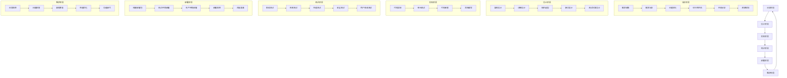

# 6A 工作流管理

## 1. 6A 工作流概述

6A 工作流是 GitHub 中文翻译插件项目采用的标准化开发与管理流程，旨在确保项目开发过程的规范性、高效性和质量可控性。6A 代表了项目生命周期中的六个关键阶段：分析（Analyze）、设计（Architect）、实现（Implement）、测试（Assess）、部署（Deploy）和维护（Administer）。

### 1.1 6A 工作流的核心价值

- **标准化流程**：确保团队成员遵循统一的工作规范
- **质量可控**：每个阶段都有明确的质量标准和验收条件
- **高效协作**：清晰的责任分工和沟通机制
- **风险管控**：早期识别和解决潜在问题
- **持续改进**：基于反馈不断优化流程

### 1.2 6A 工作流适用范围

6A 工作流适用于 GitHub 中文翻译插件项目的所有开发活动，包括：
- 新功能开发
- 现有功能优化
- 缺陷修复
- 技术债务清理
- 文档更新

## 2. 6A 工作流阶段定义

### 2.1 分析阶段（Analyze）

**目标**：明确需求，识别问题，确定解决方案的可行性。

**主要活动**：
- 需求收集与分析
- 问题识别与定义
- 可行性评估
- 风险分析
- 资源规划

**输出**：
- 需求文档
- 问题分析报告
- 可行性研究报告
- 风险评估报告

### 2.2 设计阶段（Architect）

**目标**：设计解决方案的架构和详细实现方案。

**主要活动**：
- 架构设计
- 详细设计
- 技术选型
- 接口设计
- 测试方案设计

**输出**：
- 架构设计文档
- 详细设计文档
- 技术选型报告
- 接口设计文档
- 测试计划

### 2.3 实现阶段（Implement）

**目标**：根据设计文档实现解决方案。

**主要活动**：
- 代码实现
- 单元测试
- 代码审查
- 文档编写

**输出**：
- 源代码
- 单元测试报告
- 代码审查记录
- 相关文档

### 2.4 测试阶段（Assess）

**目标**：验证实现的解决方案是否符合需求和设计要求。

**主要活动**：
- 集成测试
- 系统测试
- 性能测试
- 安全测试
- 用户验收测试

**输出**：
- 测试报告
- 缺陷记录
- 验收报告

### 2.5 部署阶段（Deploy）

**目标**：将通过测试的解决方案部署到生产环境。

**主要活动**：
- 构建部署包
- 部署到测试环境
- 部署到生产环境
- 监控部署过程
- 回滚计划

**输出**：
- 部署包
- 部署记录
- 监控报告

### 2.6 维护阶段（Administer）

**目标**：确保部署后的解决方案持续稳定运行，并根据反馈进行改进。

**主要活动**：
- 日常监控
- 问题排查与修复
- 性能优化
- 功能迭代
- 文档更新

**输出**：
- 监控报告
- 维护记录
- 优化建议
- 更新后的文档

## 3. 6A 工作流操作流程

### 3.1 流程图

### 3.2 详细操作流程

#### 3.2.1 分析阶段操作流程

1. **需求收集**
   - 收集渠道：GitHub Issues、用户反馈、团队讨论
   - 需求类型：功能需求、性能需求、安全需求、文档需求
   - 记录方式：使用 GitHub Issues 进行跟踪

2. **需求分析**
   - 对收集到的需求进行分类和优先级排序
   - 明确需求的范围和边界
   - 识别需求之间的依赖关系

3. **问题定义**
   - 明确问题的具体表现和影响范围
   - 分析问题的根本原因
   - 确定问题的优先级和解决时限

4. **可行性评估**
   - 技术可行性：现有技术栈能否支持需求实现
   - 资源可行性：是否有足够的人力、时间和资源
   - 成本效益分析：实现需求的成本与收益评估

5. **风险分析**
   - 识别潜在风险：技术风险、资源风险、时间风险
   - 评估风险的影响程度和发生概率
   - 制定风险应对策略

6. **资源规划**
   - 确定所需的人力资源：开发人员、测试人员、文档人员
   - 估算项目所需的时间和成本
   - 制定项目计划和里程碑

#### 3.2.2 设计阶段操作流程

1. **架构设计**
   - 确定系统的整体架构和组件划分
   - 设计组件之间的交互关系
   - 考虑系统的可扩展性、可维护性和性能

2. **详细设计**
   - 设计具体的实现方案和算法
   - 确定数据结构和数据库设计
   - 设计用户界面和交互流程

3. **技术选型**
   - 选择合适的技术栈和工具
   - 考虑技术的成熟度、性能和社区支持
   - 确保技术选型与项目整体架构一致

4. **接口设计**
   - 设计系统内部组件之间的接口
   - 设计与外部系统的交互接口
   - 定义接口的参数、返回值和错误处理机制

5. **测试方案设计**
   - 制定测试策略和测试计划
   - 设计测试用例和测试数据
   - 确定测试环境和测试工具

#### 3.2.3 实现阶段操作流程

1. **代码实现**
   - 按照设计文档编写代码
   - 遵循项目的代码规范和命名约定
   - 实现单元测试

2. **单元测试**
   - 编写和执行单元测试
   - 确保代码覆盖率达到项目要求
   - 修复测试中发现的问题

3. **代码审查**
   - 提交代码到版本控制系统
   - 邀请团队成员进行代码审查
   - 修复代码审查中发现的问题

4. **文档编写**
   - 编写功能文档和使用说明
   - 更新技术文档和API文档
   - 确保文档与代码保持同步

#### 3.2.4 测试阶段操作流程

1. **集成测试**
   - 测试组件之间的集成是否正常
   - 验证接口的正确性和稳定性
   - 修复集成测试中发现的问题

2. **系统测试**
   - 测试整个系统的功能和性能
   - 验证系统是否符合需求规格
   - 修复系统测试中发现的问题

3. **性能测试**
   - 测试系统的性能指标：响应时间、吞吐量、资源利用率
   - 识别性能瓶颈并进行优化
   - 确保系统在高负载下仍能正常运行

4. **安全测试**
   - 测试系统的安全性：漏洞扫描、渗透测试
   - 确保系统符合安全规范和最佳实践
   - 修复安全测试中发现的问题

5. **用户验收测试**
   - 邀请最终用户进行测试
   - 验证系统是否满足用户需求
   - 收集用户反馈并进行改进

#### 3.2.5 部署阶段操作流程

1. **构建部署包**
   - 执行构建脚本生成部署包
   - 验证部署包的完整性和正确性
   - 版本号管理和标签创建

2. **测试环境部署**
   - 将部署包部署到测试环境
   - 验证部署是否成功
   - 进行部署后的功能测试

3. **生产环境部署**
   - 制定生产部署计划和回滚策略
   - 执行生产环境部署
   - 监控部署过程和系统状态

4. **部署监控**
   - 监控系统的运行状态和性能指标
   - 及时发现和处理部署后的问题
   - 记录部署过程和结果

5. **回滚准备**
   - 制定回滚计划和步骤
   - 准备回滚所需的资源和工具
   - 确保在出现问题时能够快速回滚

#### 3.2.6 维护阶段操作流程

1. **日常监控**
   - 监控系统的运行状态和性能指标
   - 收集系统日志和错误信息
   - 及时发现和预警潜在问题

2. **问题排查**
   - 分析系统出现的问题和故障
   - 定位问题的根本原因
   - 制定解决方案

3. **缺陷修复**
   - 修复系统中的缺陷和漏洞
   - 进行修复后的测试和验证
   - 更新相关文档

4. **性能优化**
   - 分析系统的性能瓶颈
   - 进行性能优化和改进
   - 验证优化效果

5. **功能迭代**
   - 根据用户反馈和业务需求进行功能迭代
   - 按照6A工作流重新开始新的开发周期
   - 持续改进系统功能和用户体验

## 4. 6A 工作流责任分工

### 4.1 角色定义

| 角色 | 主要职责 | 参与阶段 |
|------|----------|----------|
| 项目经理 | 项目规划、资源协调、进度监控、风险管控 | 全阶段 |
| 需求分析师 | 需求收集、需求分析、问题定义 | 分析阶段 |
| 架构师 | 架构设计、技术选型、接口设计 | 设计阶段 |
| 开发工程师 | 代码实现、单元测试、代码审查 | 实现阶段 |
| 测试工程师 | 测试方案设计、测试执行、缺陷管理 | 测试阶段 |
| 运维工程师 | 部署包构建、环境部署、系统监控 | 部署阶段、维护阶段 |
| 文档工程师 | 文档编写、文档更新、文档审查 | 全阶段 |
| 产品经理 | 需求优先级排序、产品路线图制定 | 分析阶段、设计阶段 |

### 4.2 责任矩阵

| 阶段 | 项目经理 | 需求分析师 | 架构师 | 开发工程师 | 测试工程师 | 运维工程师 | 文档工程师 | 产品经理 |
|------|----------|------------|--------|------------|------------|------------|------------|----------|
| 分析 | 主导 | 主导 | 参与 | 参与 | 参与 | 参与 | 参与 | 主导 |
| 设计 | 参与 | 参与 | 主导 | 参与 | 参与 | 参与 | 参与 | 参与 |
| 实现 | 监控 | 参与 | 指导 | 主导 | 参与 | 参与 | 参与 | 参与 |
| 测试 | 监控 | 参与 | 参与 | 参与 | 主导 | 参与 | 参与 | 参与 |
| 部署 | 协调 | 参与 | 参与 | 参与 | 参与 | 主导 | 参与 | 参与 |
| 维护 | 监控 | 参与 | 参与 | 参与 | 参与 | 主导 | 参与 | 参与 |

## 5. 6A 工作流决策标准

### 5.1 阶段进入/退出标准

#### 5.1.1 分析阶段

**进入标准**：
- 项目需求已明确
- 项目团队已组建
- 项目资源已初步分配

**退出标准**：
- 需求文档已完成并通过评审
- 问题定义已明确
- 可行性评估已完成
- 风险分析报告已生成
- 资源规划已完成

#### 5.1.2 设计阶段

**进入标准**：
- 分析阶段已完成并通过评审
- 需求文档已批准
- 资源已到位

**退出标准**：
- 架构设计文档已完成并通过评审
- 详细设计文档已完成
- 技术选型已确定
- 接口设计已完成
- 测试方案已制定

#### 5.1.3 实现阶段

**进入标准**：
- 设计阶段已完成并通过评审
- 设计文档已批准
- 开发环境已准备就绪

**退出标准**：
- 代码实现已完成
- 单元测试覆盖率达到要求（≥80%）
- 代码审查已通过
- 相关文档已编写完成

#### 5.1.4 测试阶段

**进入标准**：
- 实现阶段已完成并通过评审
- 代码已提交到测试分支
- 测试环境已准备就绪

**退出标准**：
- 所有测试用例已执行完成
- 严重缺陷已全部修复
- 测试通过率达到要求（≥95%）
- 测试报告已生成并通过评审

#### 5.1.5 部署阶段

**进入标准**：
- 测试阶段已完成并通过评审
- 测试报告已批准
- 部署环境已准备就绪
- 回滚计划已制定

**退出标准**：
- 部署包已成功构建
- 测试环境部署已完成并验证通过
- 生产环境部署已完成并验证通过
- 部署监控正常
- 回滚方案已验证

#### 5.1.6 维护阶段

**进入标准**：
- 部署阶段已完成并通过评审
- 系统已成功上线
- 监控系统已部署

**退出标准**：
- 系统生命周期结束
- 系统已迁移到新的平台或架构
- 维护成本超过预期收益

### 5.2 决策流程

1. **需求决策**：由产品经理主导，项目经理、需求分析师、架构师参与，根据需求的优先级、可行性和资源情况进行决策。

2. **设计决策**：由架构师主导，项目经理、开发工程师、测试工程师参与，根据技术可行性、性能要求、可维护性进行决策。

3. **实现决策**：由开发工程师主导，架构师、测试工程师参与，根据代码质量、性能、安全性进行决策。

4. **测试决策**：由测试工程师主导，开发工程师、项目经理参与，根据测试结果、缺陷严重程度进行决策。

5. **部署决策**：由运维工程师主导，项目经理、开发工程师、测试工程师参与，根据部署风险、回滚准备情况进行决策。

6. **维护决策**：由运维工程师主导，项目经理、开发工程师参与，根据问题严重程度、影响范围进行决策。

## 6. 6A 工作流相关示例

### 6.1 新功能开发示例

**功能需求**：添加 GitHub Codespaces 页面的中文翻译支持

#### 分析阶段
- 收集需求：用户反馈 GitHub Codespaces 页面未翻译
- 需求分析：需要翻译 Codespaces 相关的所有界面元素
- 可行性评估：技术上可行，预计需要 2 人天
- 风险分析：GitHub 可能会更新 Codespaces 界面，导致翻译失效
- 资源规划：分配 1 名开发工程师，预计 2 天完成

#### 设计阶段
- 架构设计：在现有翻译框架基础上添加 Codespaces 翻译模块
- 详细设计：创建 codespaces.js 翻译词典文件，添加相关翻译条目
- 技术选型：使用现有的翻译框架和工具
- 接口设计：无需修改现有接口
- 测试方案：测试 Codespaces 页面的翻译效果

#### 实现阶段
- 代码实现：创建 codespaces.js 文件，添加翻译条目
- 单元测试：编写单元测试验证翻译功能
- 代码审查：提交代码进行审查
- 文档编写：更新用户指南，添加 Codespaces 翻译说明

#### 测试阶段
- 集成测试：测试翻译模块与现有系统的集成
- 系统测试：测试 Codespaces 页面的翻译效果
- 性能测试：确保翻译不会影响页面加载速度
- 安全测试：确保翻译代码没有安全漏洞
- 用户验收测试：邀请用户测试 Codespaces 翻译效果

#### 部署阶段
- 构建部署包：生成新的用户脚本版本
- 测试环境部署：部署到测试环境进行验证
- 生产环境部署：发布新版本到 GitHub
- 部署监控：监控部署后的用户反馈
- 回滚准备：准备回滚方案

#### 维护阶段
- 日常监控：监控用户反馈和系统日志
- 问题排查：处理用户报告的翻译问题
- 缺陷修复：修复翻译错误
- 性能优化：优化翻译加载速度
- 功能迭代：根据 GitHub 界面更新进行翻译迭代

### 6.2 缺陷修复示例

**缺陷描述**：GitHub 仓库页面的 "Actions" 标签翻译错误

#### 分析阶段
- 问题定义："Actions" 标签被翻译为 "动作"，正确翻译应为 "操作"
- 可行性评估：修复简单，预计需要 0.5 人天
- 风险分析：低风险
- 资源规划：分配 1 名开发工程师，预计 0.5 天完成

#### 设计阶段
- 设计方案：修改 common.js 翻译词典中的 "Actions" 翻译条目
- 测试方案：测试仓库页面的 "Actions" 标签翻译

#### 实现阶段
- 代码实现：修改 common.js 文件中的翻译条目
- 单元测试：验证翻译修改
- 代码审查：提交代码进行审查

#### 测试阶段
- 系统测试：测试仓库页面的 "Actions" 标签翻译效果
- 用户验收测试：验证修复效果

#### 部署阶段
- 构建部署包：生成新的用户脚本版本
- 生产环境部署：发布修复版本
- 部署监控：监控用户反馈

#### 维护阶段
- 日常监控：监控类似翻译问题
- 持续改进：优化翻译质量

## 7. 6A 工作流工具支持

### 7.1 项目管理工具
- **GitHub Issues**：需求跟踪、缺陷管理、任务分配
- **GitHub Projects**：项目看板、进度监控
- **GitHub Milestones**：版本规划、里程碑管理

### 7.2 开发工具
- **Visual Studio Code**：代码编辑、调试
- **ESLint**：代码质量检查
- **Jest**：单元测试、集成测试

### 7.3 部署工具
- **GitHub Actions**：自动化构建、测试、部署
- **Tampermonkey**：用户脚本管理

### 7.4 监控工具
- **GitHub Analytics**：项目使用情况分析
- **用户反馈系统**：收集用户反馈和问题报告

## 8. 6A 工作流持续改进

6A 工作流是一个持续改进的过程，项目团队应定期对工作流进行评估和优化：

1. **定期回顾**：每季度进行一次 6A 工作流回顾会议
2. **收集反馈**：收集团队成员和用户的反馈意见
3. **数据分析**：分析项目数据，识别流程瓶颈
4. **优化改进**：根据反馈和数据分析结果，对工作流进行优化
5. **更新文档**：及时更新 6A 工作流文档，反映最新的流程和规范

## 9. 相关链接

- [项目管理](../README.md)
- [版本历史](../01-版本历史/README.md)
- [路线图](../02-路线图/README.md)
- [TODO列表](../03-TODO列表/README.md)
- [文档管理](../../07-文档管理